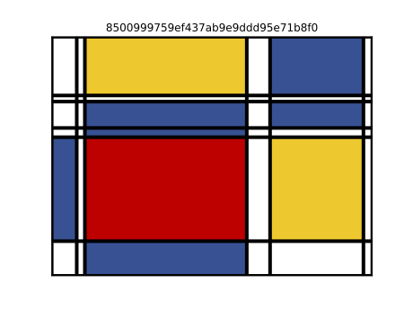

Sub-directory to explore the visualization of randomness and random data.

### Intro
I'm interested in randomness.  The random data used to provide the visualizations created by this package is provided via [numpy's random module](https://numpy.org/doc/stable/reference/random/index.html#module-numpy.random).

### Installation
The dependencies for this project can be installed via `pip`:

    pip install -r requirements.txt
    

## Python Modules
There are several python modules/scripts in the `src` sub-directory. This contains the code that produces the data visualizations below.

#### mondrianMaker
**Sample *randomly-created* 'Mondrian Style' image**
The `mondrianMaker.py` script contained in the `src` sub-directory produces ['*Mondrian-style*'(https://www.google.com/url?sa=t&rct=j&q=&esrc=s&source=web&cd=&ved=2ahUKEwjZ2ZTJxMr0AhX4jIkEHb_gDqIQFnoECAMQAQ&url=https%3A%2F%2Fen.wikipedia.org%2Fwiki%2FPiet_Mondrian&usg=AOvVaw3gIr84anCOfzhG9ksYQbVU)] images from randomly generated number sequences. The black gridlines and color map for the squares are generated via numpy's random module.

